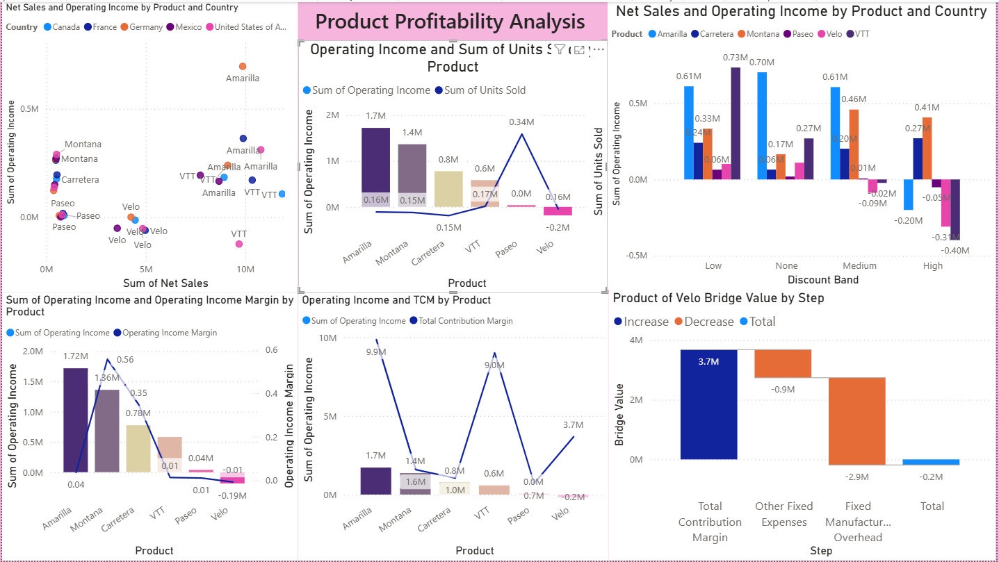
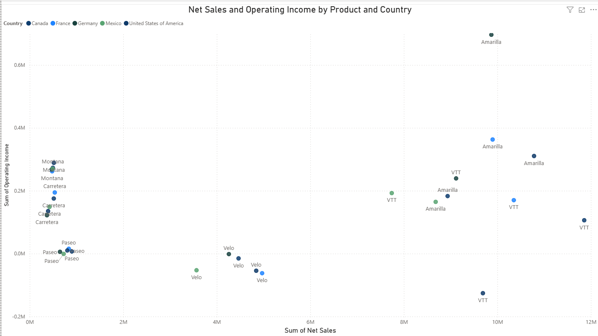
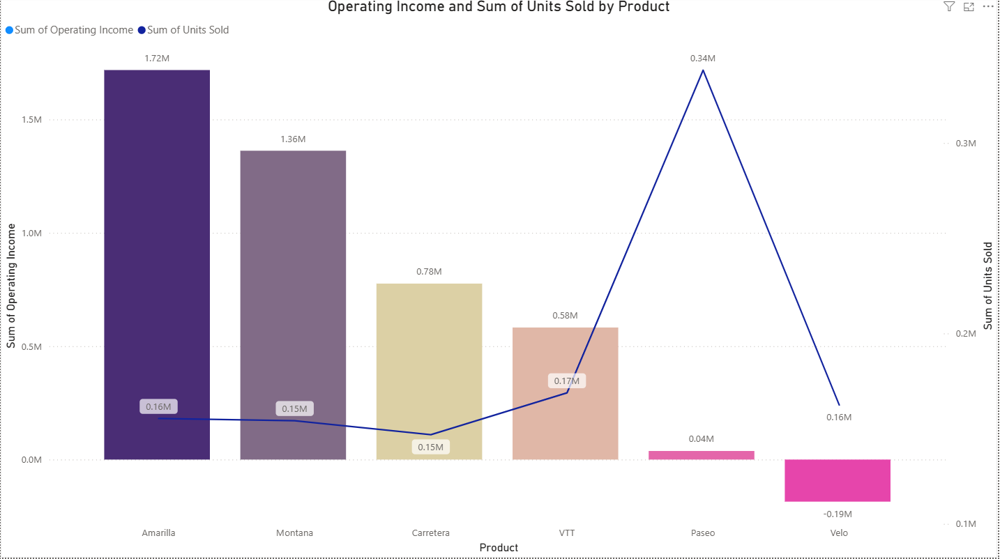
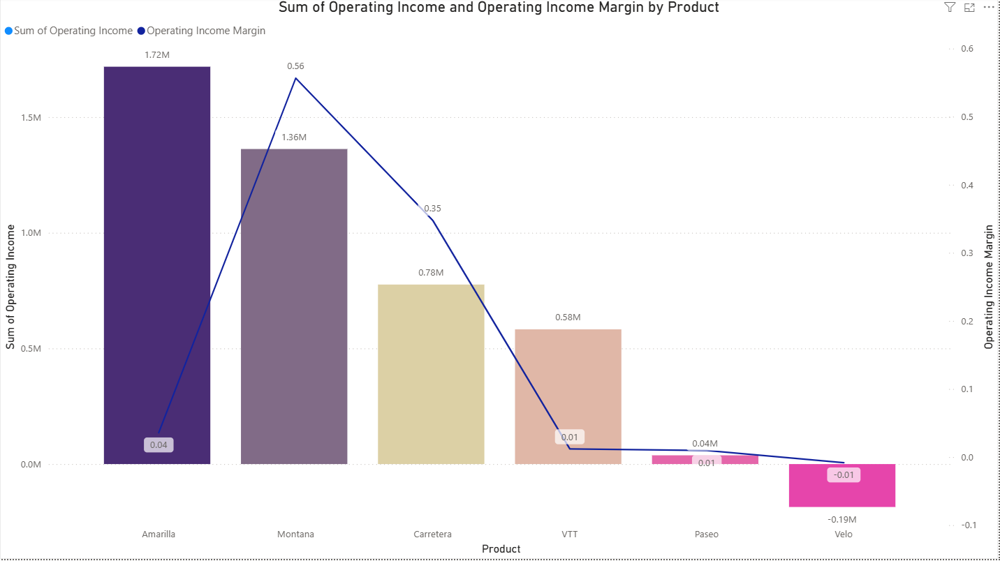
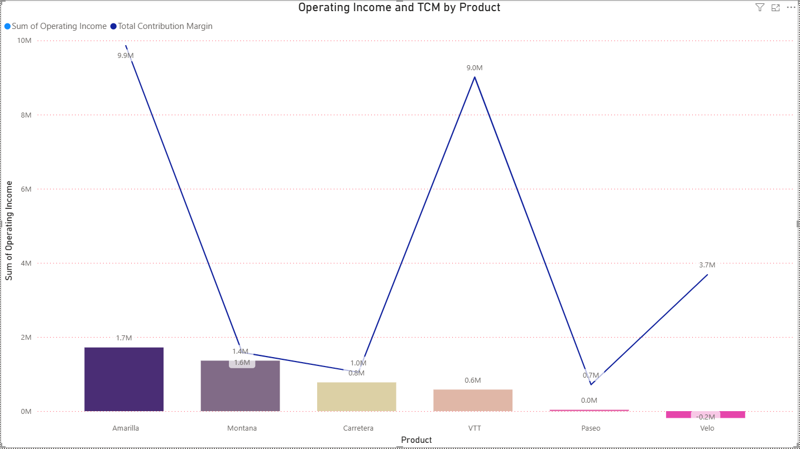
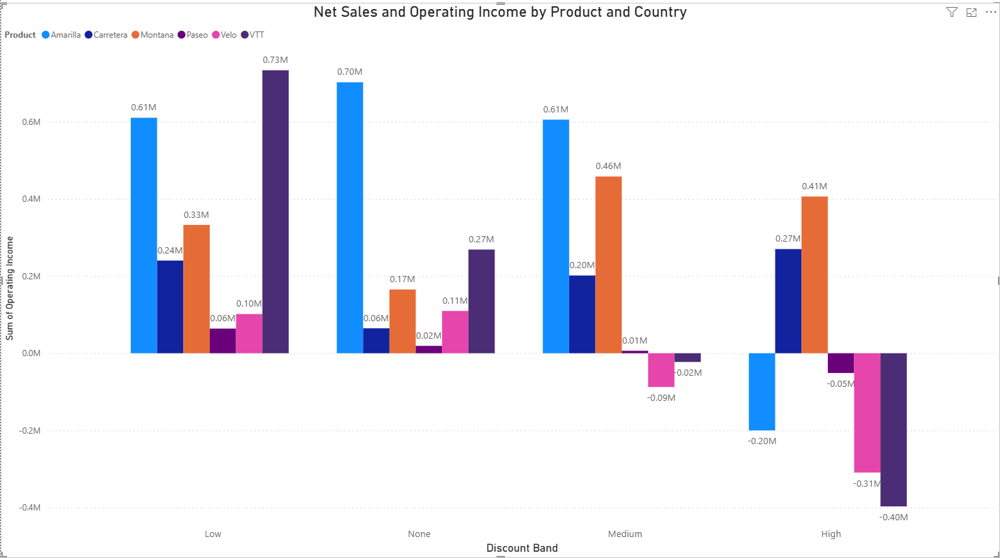
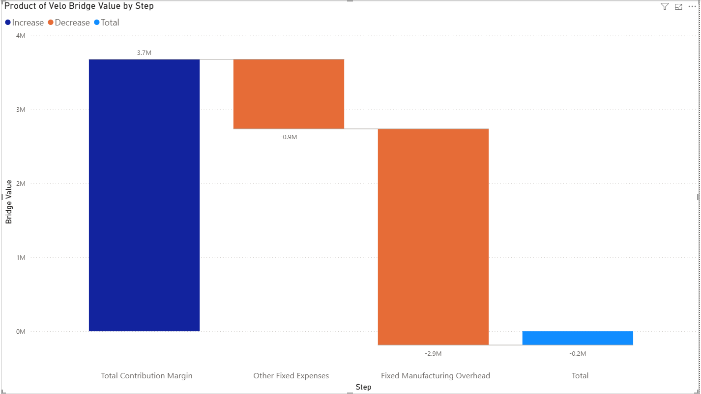

# Power BI Engineering Analytics Project

## Overview

This repository presents an end-to-end Business Intelligence and Engineering Analytics project developed using Microsoft Power BI.

The project demonstrates the complete data analytics workflow—from raw Excel datasets to interactive dashboards and business insights—using Power Query, DAX, Python, and Excel.

The objective is to transform raw operational data into meaningful visualizations that support business decision-making.

---

## Project Objectives

The project demonstrates how Business Intelligence tools can be used to:

- Clean and transform raw datasets
- Build an optimized data model
- Create business KPIs using DAX
- Design interactive dashboards
- Discover business insights through visualization
- Support data-driven decision making

---

## Skills & Technologies

| Technology | Purpose |
|------------|--------------------------------|
| Power BI | Dashboard Development |
| Power Query | ETL / Data Cleaning |
| DAX | KPI Calculations |
| Excel | Source Dataset |
| Python | Data Processing |
| Data Visualization | Business Analytics |

---

## Project Workflow

```
Raw Business Data (Excel)
        │
        ▼
Power Query
(Data Cleaning & Transformation)
        │
        ▼
Data Modeling
(Table Relationships)
        │
        ▼
DAX Measures & KPIs
        │
        ▼
Interactive Dashboard Design
        │
        ▼
Business Insights
        │
        ▼
Decision Support
```

---

## Project Methodology

### 1. Data Collection

- Imported source data from Excel
- Verified data completeness

### 2. Data Cleaning & Transformation

Using **Power Query**:

- Removed duplicates
- Standardized data types
- Handled missing values
- Renamed fields
- Created calculated columns
- Prepared clean datasets for analysis

### 3. Data Modeling

- Built table relationships
- Optimized data model
- Improved reporting efficiency

### 4. KPI Development

Using **DAX**:

- Revenue KPIs
- Profit KPIs
- Sales Metrics
- Calculated Measures
- Business Indicators

### 5. Dashboard Design

Designed interactive dashboards including:

- KPI Cards
- Clustered Column Charts
- Scatter Charts
- Line & Column Charts
- Waterfall Charts
- Interactive Filters (Slicers)

### 6. Business Insights

The dashboards help users:

- Monitor sales performance
- Analyze profitability
- Compare product categories
- Track trends over time
- Support business decision-making

---

# Dashboard Gallery

## Main Dashboard



---

## Scatter Analysis



---

## Line & Column Analysis







---

## Clustered Column Chart



---

## Waterfall Analysis



---

## Repository Structure

```
powerbi-engineering-analytics

│
├── README.md
├── PowerBI_Engineering_Analytics.pbix
├── Power BI Final Analytical Report.pdf
│
└── images
    ├── 1Dashboard.png
    ├── 2scatter_chart.png
    ├── 3line&column_chart.png
    ├── 4clustered_column_chart.png
    ├── 5line&column_chart.png
    ├── 6line&column_chart.png
    └── 7waterfall_chart.png
```

---

## Files Included

- Power BI Project (.pbix)
- Final Analytical Report (PDF)
- Dashboard Screenshots
- Project Documentation

---

## Future Improvements

Future versions may include:

- SQL Database Integration
- Azure Cloud Deployment
- Live Data Refresh
- REST API Connection
- AI-assisted Analytics
- Real-time Dashboard

---

## About

This project was completed during the **Master of Engineering Entrepreneurship & Innovation (MEEI)** program at **McMaster University**.

It demonstrates practical Business Intelligence skills that can be applied to engineering, manufacturing, operations, and project management environments.
